<header style="border-bottom: 1px solid #eee; padding-bottom: 1rem; margin-bottom: 2rem;">
  
  <div style="display: inline-block; vertical-align: middle; margin-left: 1rem;">
    <h1 style="margin:0; font-size:2rem;">My Design System</h1>
    <p style="margin:0.25rem 0 0; color:#555;">
      A reusable UI toolkit built with React, TypeScript, and TailwindCSS.
    </p>
  </div>
</header>

## Table of Contents
1. [Built With](#built-with)
2. [Installation](#installation)
3. [Usage](#usage)
4. [Features](#features)
5. [Folder Structure](#folder-structure)
6. [Storybook Preview](#storybook-preview)
7. [Contributing](#contributing)
8. [License](#license)
9. [Contact](#contact)


## Badges


[](https://6807280b26f33c9645aee56b-xsgzskrlqs.chromatic.com)
[](https://www.typescriptlang.org/)
[](https://reactjs.org/)

## Built With
- React
- TypeScript
- TailwindCSS
- Storybook

## Installation
```bash
# Clone the repository
git clone https://github.com/iftykhar/design-system.git

# Move into the project directory
cd design-system

# Install dependencies
npm install

```

## Usage

### Getting Started
```bash
# Start the development server
npm start

# Build for production
npm run build

# Launch Storybook documentation
npm run storybook
```


## Features
- **Typography**: Headings H1–H6, paragraph, labels, captions, helper text  
- **Data Entry**: TextInput, Checkbox, with error/disabled/helper states  
- **Feedback**: Toast (auto-dismiss/close), AlertBanner (dismissible)  
- **Theming**: Light/dark mode support  
- **Accessibility**: ARIA roles, keyboard navigation  

## Folder Structure
src/  
├─ components/  
│  ├─ Typography/  
│  ├─ TextInput/  
│  ├─ Toast/  
│  └─ AlertBanner/  
├─ tokens/  
│  ├─ colors.ts  
│  └─ typography.ts  
└─ stories/  
   └─ ...  


---

## Contributing
Please read [CONTRIBUTING.md](CONTRIBUTING.md) for guidelines on how to get started. All PRs should follow the existing code style and include storybook stories for new components.

## License
This project is licensed under the MIT License. See [LICENSE](LICENSE) for details.


## Contact

Iftykhar Alam – [s.m.ifty49@gmail.com](mailto:s.m.ifty49@gmail.com)  


## Storybook Preview
🔗 https://6807280b26f33c9645aee56b-xsgzskrlqs.chromatic.com/


## Storybook 

### TextInput

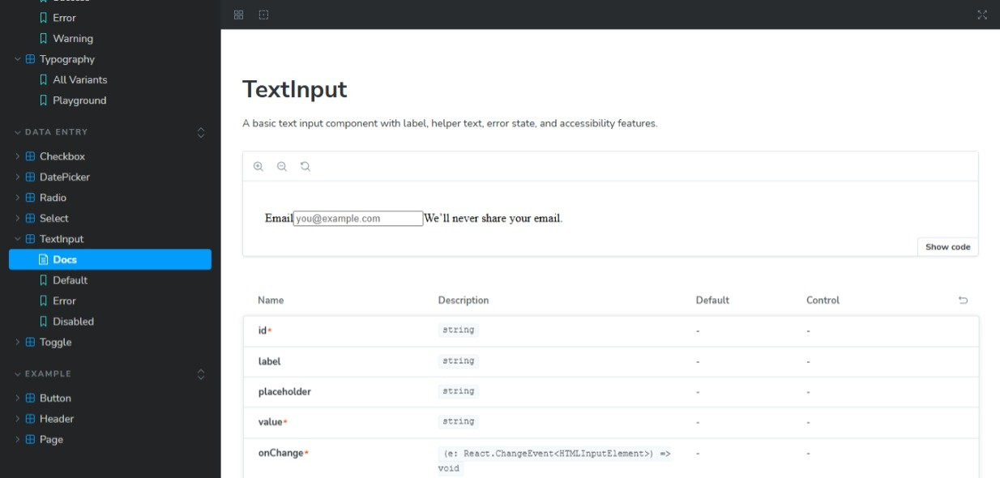

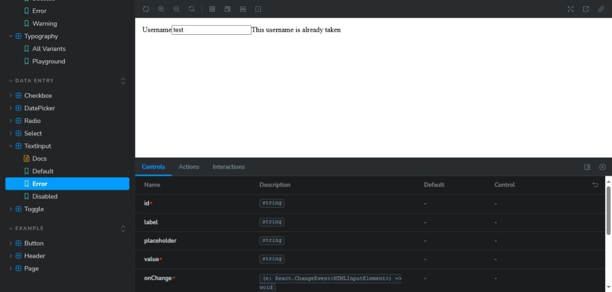

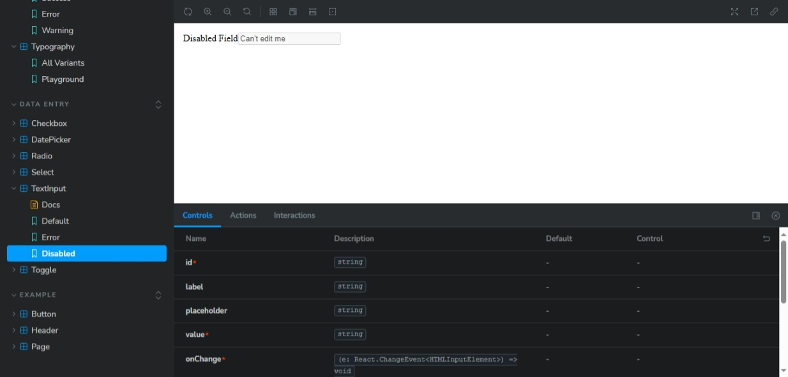


### DatePicker
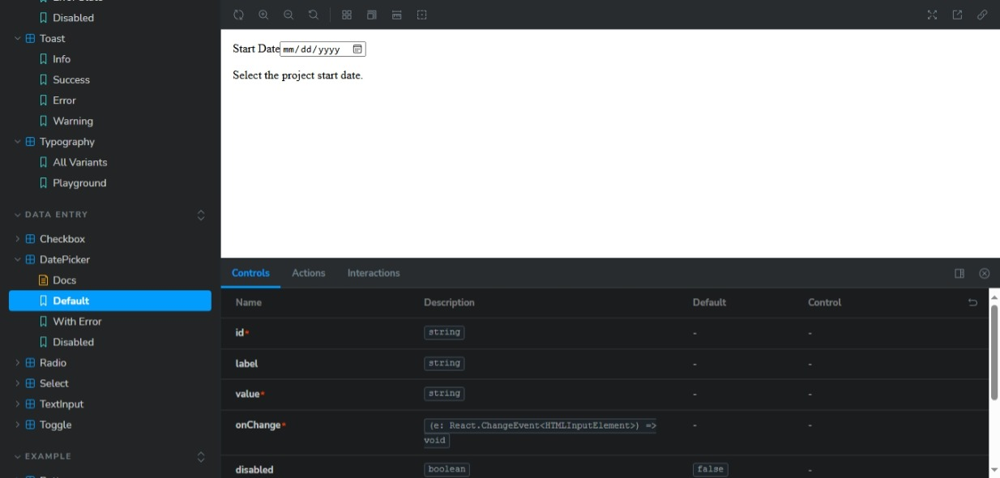

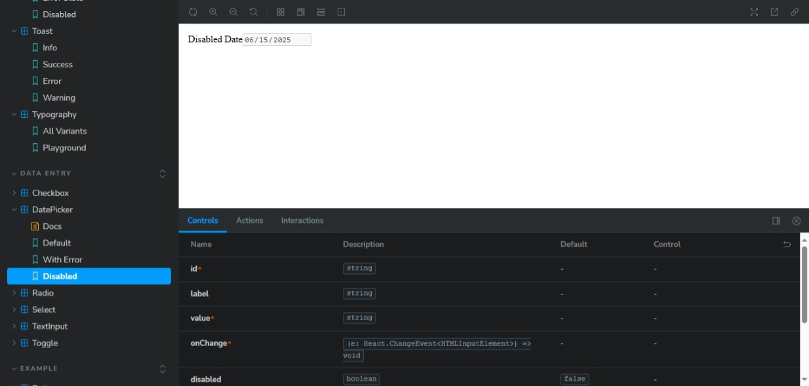

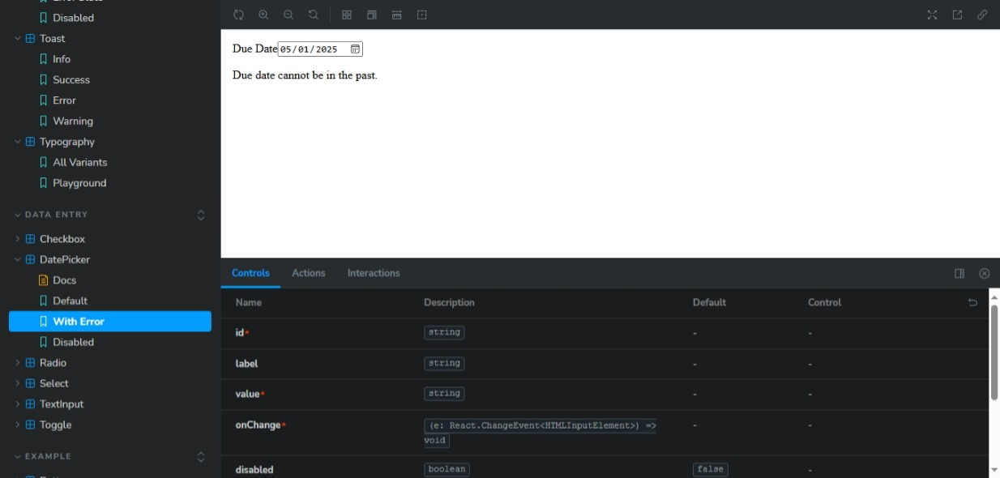

### Checkbox

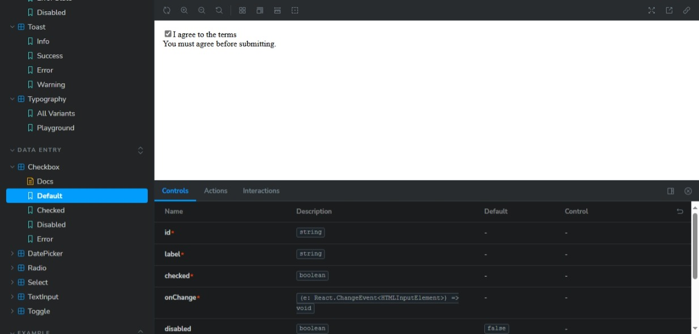

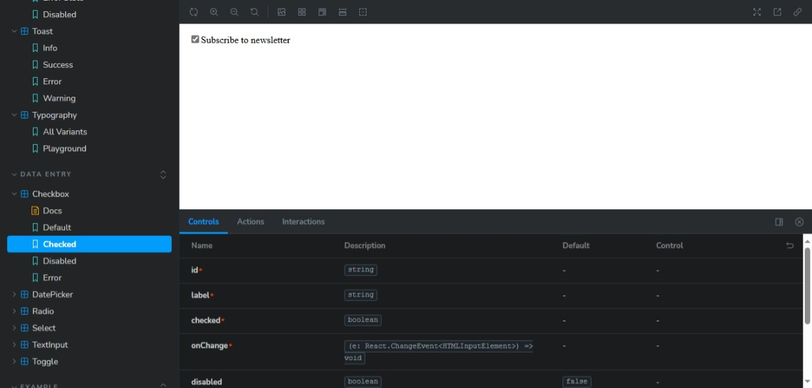


### Select 

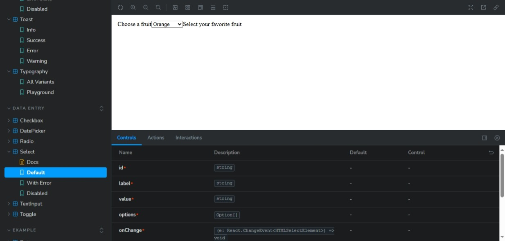

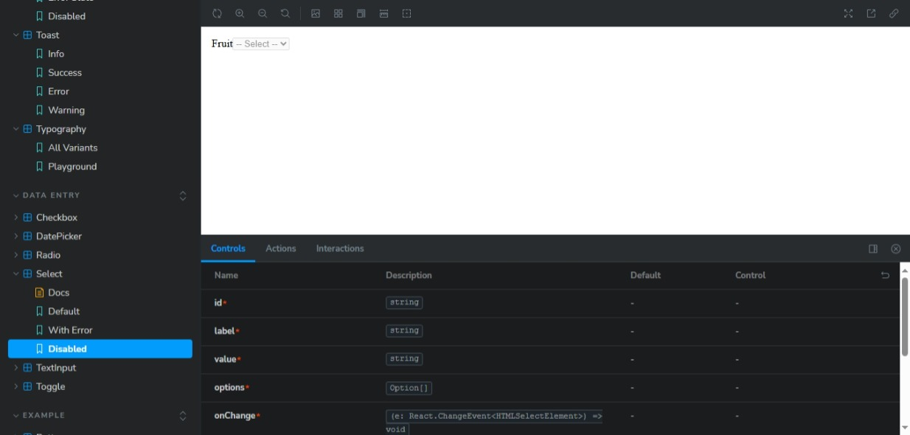

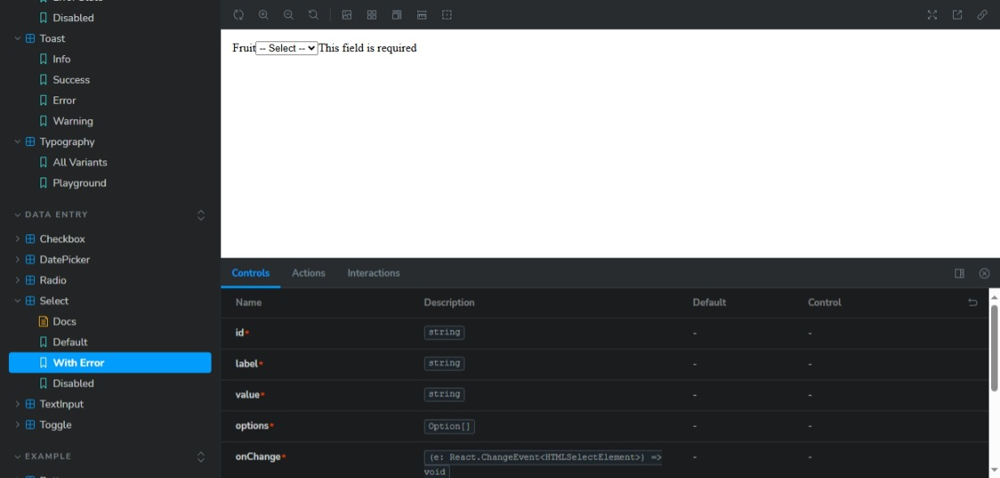

### Radio

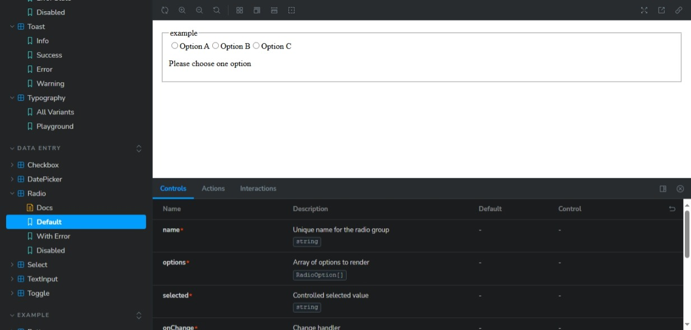


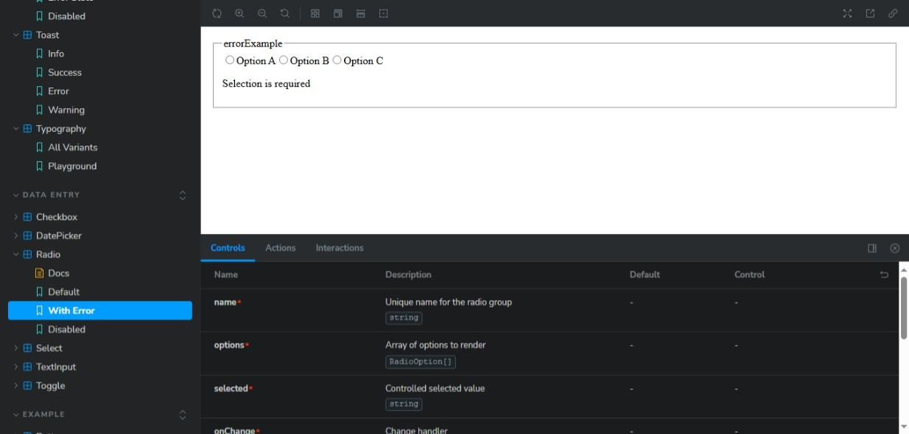

### Toggle 

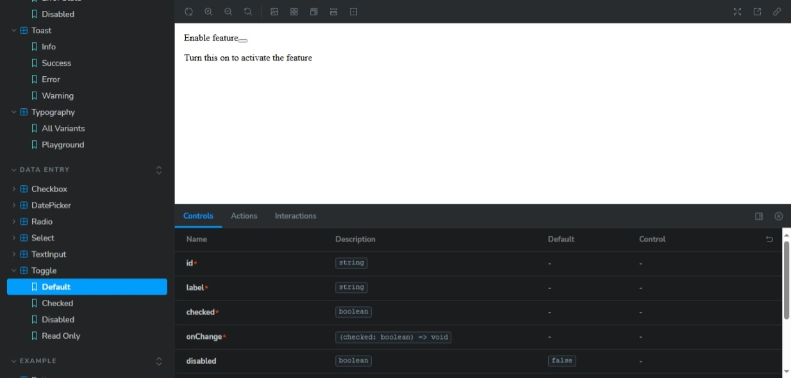

### FileUpload

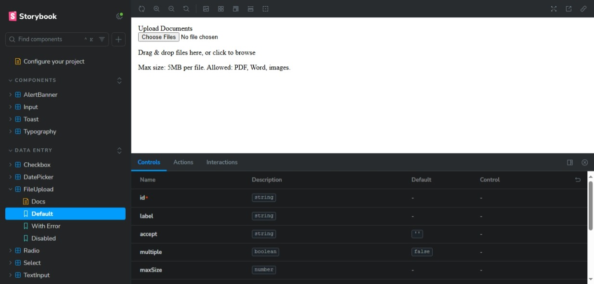

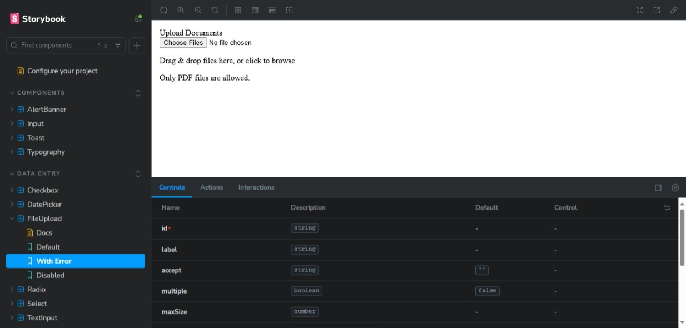

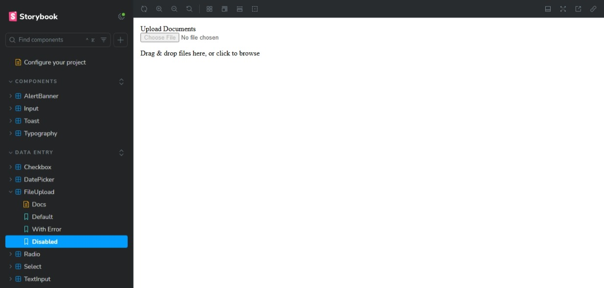